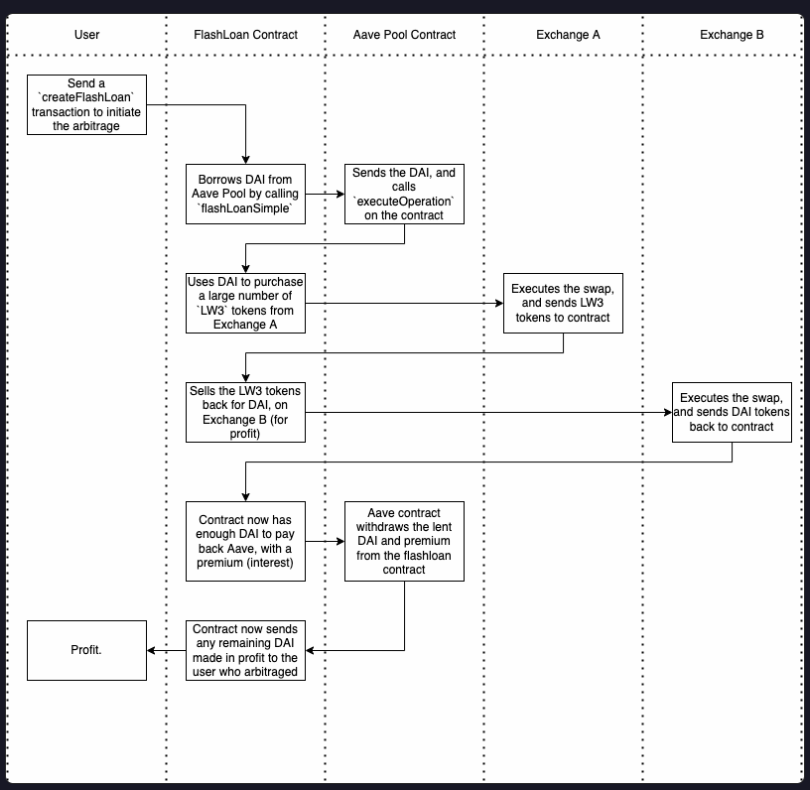

# Aave Flash Loan Smart Contract

This smart contract interacts with Aave v3 to execute **flash loans**, allowing users to borrow assets without collateral as long as they repay within the same transaction.

## 🤔 How do Flash Loans work?

## How It Works
1. The contract requests a **flash loan** from Aave.
2. The borrowed funds can be used for arbitrage, liquidation, or other strategies.
3. The contract repays the loan with a **small premium** before the transaction ends.

## Features
- **Aave v3 Integration** using `FlashLoanSimpleReceiverBase`.
- **No collateral required** for borrowing.
- **Custom execution logic** for using borrowed funds.

## Usage
1. Deploy the contract with the **Aave Pool Address Provider**.
2. Call `requestFlashLoan(address asset, uint256 amount)`.
3. Implement custom logic inside `executeOperation` (e.g., arbitrage).
4. The contract automatically repays the loan + fees.

## Dependencies
- Aave v3: `@aave/core-v3`
- OpenZeppelin ERC20: `@openzeppelin/contracts/token/ERC20/IERC20.sol`

## Notes
- The borrowed funds **must be repaid within the same transaction**.
- Make sure to implement a profitable strategy inside `executeOperation`.

## License
This project is licensed under the **MIT License**.
