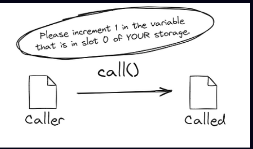
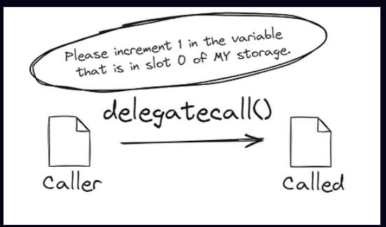
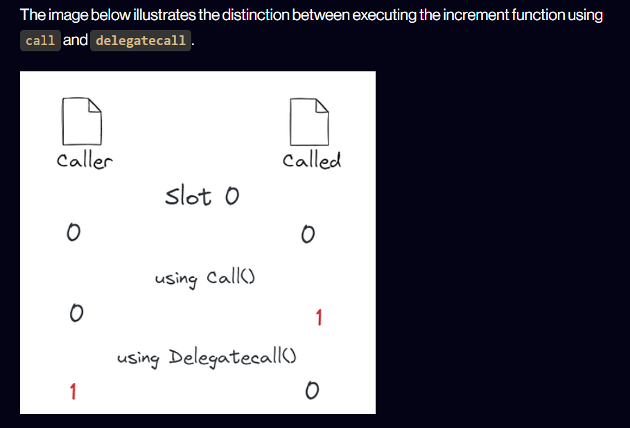

# The Bug That Lets Attackers Control Your Smart Contract: Delegate Call

**Delegate Call** is a powerful yet dangerous feature in Solidity that allows a contract to execute another contract's code while keeping its own storage. If misused, it can lead to critical security vulnerabilities, where an attacker can take complete control of a contract.  

One of the most infamous **delegate call vulnerabilities** was the **Parity Wallet Hack** in 2017, which resulted in the loss of **over $150 million worth of Ethereum**. The attack was possible because of improper handling of the `delegatecall` function, which allowed an attacker to modify the ownership of the contract. 😱  

---

## Delegate Call Attack Example

This project demonstrates how a **delegate call attack** works in Solidity smart contracts and how to prevent it. **Delegate call allows a contract to execute another contract's code while preserving its own storage.**  

### How a Delegate Call Attack Looks Like


### How It Works
1. A contract (`Proxy`) uses `delegatecall` to execute another contract's (`LogicContract`) code.
2. The `LogicContract` has a function that modifies storage.
3. If the `LogicContract` is **malicious** or **upgraded improperly**, an attacker can use `delegatecall` to modify **critical storage variables** in `Proxy` (like changing the owner).
4. The attacker can then **gain full control of the contract**.

### Store data in caller or called contracrt
- **Using call**
---


- **Using delegatecall**

- **Differnce between cal and deegate call**


### Features
- **Exploit Demonstration** using a vulnerable proxy contract.
- **Attacker Smart Contract** that exploits the vulnerability.
- **Secure Implementation** with proper function access control.

---

## Smart Contracts  

### 🔴 Vulnerable Contract (Using Delegate Call)
This contract allows another contract’s logic to modify its storage, making it vulnerable to an attack.

```solidity
// 🚨 Vulnerable Smart Contract 🚨
pragma solidity ^0.8.24;

contract Proxy {
    address public implementation;
    address public owner;

    constructor(address _implementation) {
        implementation = _implementation;
        owner = msg.sender;
    }

    function upgrade(address _newImplementation) public {
        require(msg.sender == owner, "Not authorized");
        implementation = _newImplementation;
    }

    fallback() external payable {
        (bool success, ) = implementation.delegatecall(msg.data);
        require(success, "Delegatecall failed");
    }
}
