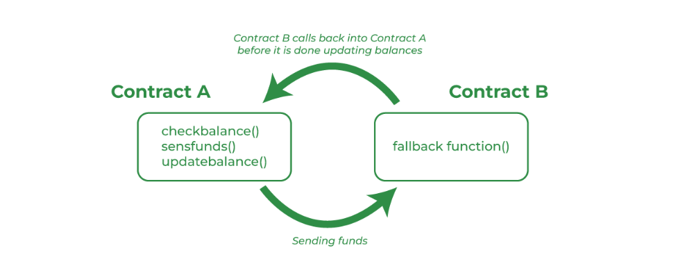

# The bug which cost ethereum 60 million dollars Re-Entrancy
Re-Entrancy is one of the oldest security vulnerabilities discovered in smart contracts. The exact vulnerability caused the infamous 'DAO Hack' of 2016. Over 3.6 million ETH was stolen in the hack, which is worth billions of dollars today. 🤯

At the time, the DAO contained 15% of all Ethereum on the network as Ethereum was relatively new. The failure was having a negative impact on the Ethereum network, and Vitalik Buterin proposed a software fork where the attacker would never be able to transfer out his ETH. Some people agreed some did not. This was a highly controversial event, and one which still is full of controversy.

At the end, it led to Ethereum being forked into two - Ethereum Classic, and the Ethereum we know today. Ethereum Classic's blockchain is the exact same as Ethereum up until the fork, but then proceeded as if the hack did happen and the attacker still controls the stolen funds. Today's Ethereum implemented the blacklist and it's as if that attack never happened. 🤔

# Reentrancy Attack Example

This project demonstrates how a **reentrancy attack** works in Solidity smart contracts and how to prevent it. Reentrancy attacks allow an attacker to repeatedly call a function before the first execution is completed, potentially draining funds from a contract.

## How Re-Entrcy attack looks like

## How It Works
1. A user deposits ETH into a vulnerable contract.
2. The attacker calls `withdraw()`, which sends ETH **before** updating the balance.
3. The attacker's contract has a `fallback()` function that **automatically calls `withdraw()` again**.
4. The process **repeats multiple times**, draining the contract’s funds.

## Features
- **Exploit Demonstration** using a vulnerable smart contract.
- **Attacker Smart Contract** that exploits the vulnerability.
- **Secure Implementation** with proper balance updates and `nonReentrant` protection.

